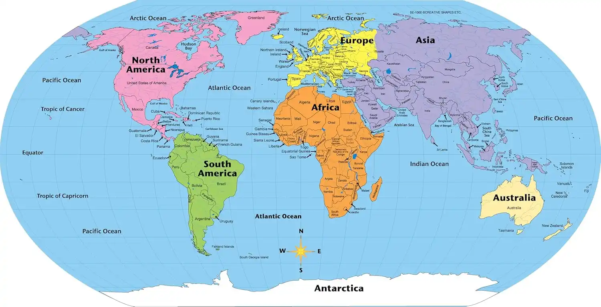

# Grade 1–2 Geography Lesson: Our World and Continents

## Objective
By the end of this lesson, students will:
- Know what a continent is.
- Name the seven continents.
- Understand that the Earth is made of land and water.

---

## 1. What is Geography?
**Geography** is the study of the Earth — its land, water, and the people and animals living on it.

---

## 2. Continents
A **continent** is a large piece of land.  
The Earth has **7 continents**:
1. **Asia**
2. **Africa**
3. **North America**
4. **South America**
5. **Antarctica**
6. **Europe**
7. **Australia**

---

## 3. Land and Water
- Land includes mountains, forests, deserts, and cities.
- Water includes oceans, rivers, and lakes.
- Most of the Earth’s surface is covered with water.

---

## 4. Fun Facts
- The **largest** continent is Asia.
- The **smallest** continent is Australia.
- Antarctica is the **coldest** place on Earth.

---

## 5. Practice Questions
1. How many continents are there?
2. Name one continent.
3. Is Antarctica hot or cold?
4. What covers most of the Earth — land or water?
5. Which continent is the smallest?

---

## Homework
- Draw a simple map of the world.
- Color the land green and the water blue.
- Label **at least 3 continents** on your map.
